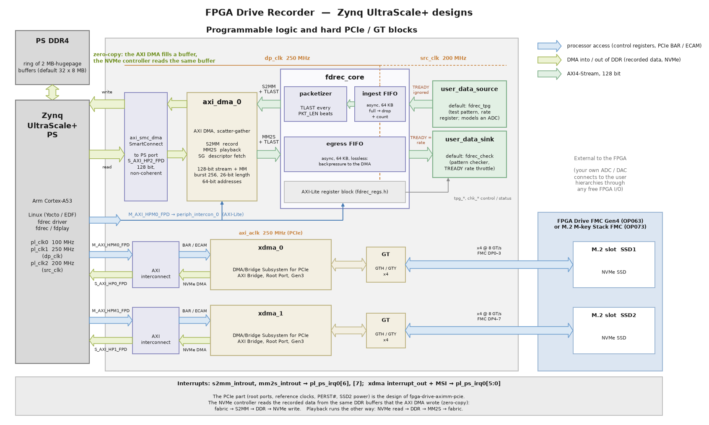
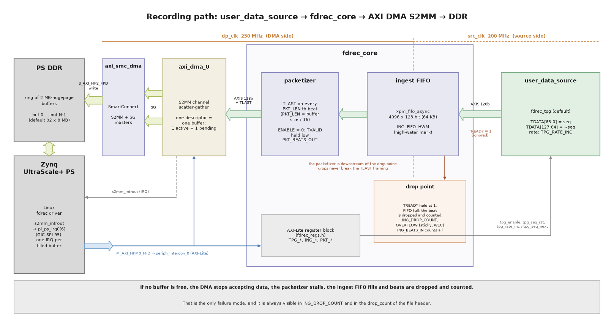
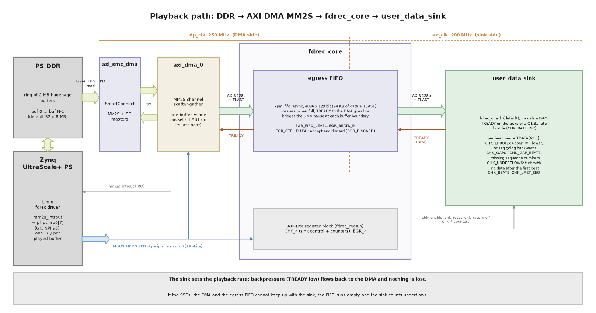
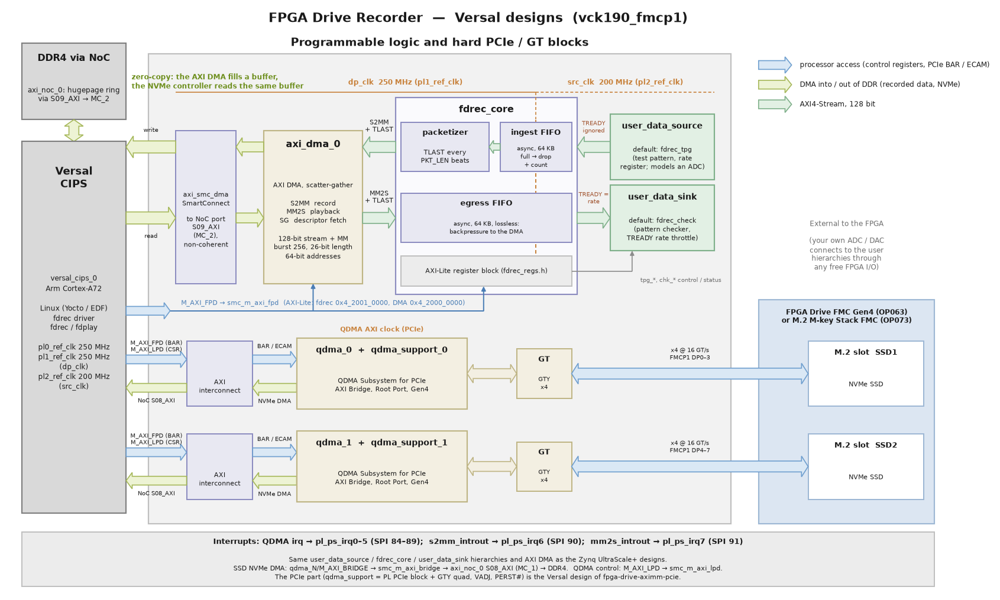

# Architecture

The recorder adds a streaming capture path to the PCIe root-port design from
[fpga-drive-aximm-pcie](https://github.com/fpgadeveloper/fpga-drive-aximm-pcie). The fabric
generates (or receives) data, and an AXI DMA writes it into buffers in PS DDR. The NVMe SSDs
then read those same buffers through the PCIe root ports when Linux writes the file with
`O_DIRECT`. The CPU never copies the data (zero-copy). It only does the bookkeeping.

## Block diagram

How to read the diagram:

* The **blue arrows** are the processor's accesses: AXI-Lite to the `fdrec_core` registers
  and the AXI DMA, and the PCIe configuration (ECAM) and BAR windows of the Root Ports.
* The **green arrows** are DMA traffic into and out of DDR memory: the AXI DMA writing
  (record) and reading (playback) the buffers, and the SSDs' NVMe DMA. Both use the
  same buffers, which is what makes the design zero-copy.
* The pale green arrows are the 128-bit AXI4-Stream datapath. The orange labels are the
  clock domains: `dp_clk` (250 MHz) for the DMA side and `src_clk` (200 MHz) for the
  source and sink; the asynchronous FIFOs in `fdrec_core` cross between them.
* The block design is generated by one Tcl script per device family
  (`Vivado/src/bd/bd_<family>.tcl`; `bd_zynqmp.tcl` for Zynq UltraScale+, `bd_versal.tcl`
  for Versal; see [Versal designs](#versal-designs)).

The diagram is generated by `docs/source/images/gen_block_diagram.py` (Python 3 with
matplotlib); edit and run it after a change to the block design.

The recording path in more detail, with the block-design cell names:

The PCIe part (both XDMA root ports, their reference clocks, `perst` outputs and the
SSD2 power control) is the same as in the base design.

### Playback path

Playback (register map 1.1) runs the same chain in reverse: Linux reads a recording from
the SSDs into the DDR buffers with `O_DIRECT`, and the AXI DMA's MM2S channel streams the
buffers back into the fabric.

## Datapath

1. **`user_data_source`** — the insertion point for your own data. On the reference
   design it holds `fdrec_tpg`, a test pattern generator. Each 128-bit beat carries a
   64-bit sequence number in `TDATA[63:0]` and its complement in `TDATA[127:64]`. A
   fractional accumulator sets the average rate, up to one beat per `src_clk` cycle. The
   source models an ADC and cannot be stalled: `TREADY` is ignored.
   See [Replacing the test pattern generator](custom_source.md).
2. **Ingest** (`fdrec_ingest`) — an asynchronous FIFO (`xpm_fifo_async`, 4096 × 128 bits =
   64 KB of block RAM) moves the stream from `src_clk` to `dp_clk`. `TREADY` towards the
   source is always 1. If a beat arrives while the FIFO is full, the beat is dropped and
   counted (`ING_DROP_COUNT`), and the sticky `OVERFLOW` flag is set. `ING_BEATS_IN` counts
   every beat offered, and `ING_FIFO_HWM` records the highest fill level.
3. **Packetizer** (`fdrec_packetizer`) — asserts `TLAST` on every `PKT_LEN`-th beat. The
   driver sets `PKT_LEN` = buffer size / 16, so every DMA descriptor ends exactly on a buffer
   boundary. The packetizer is downstream of the drop point, so drops never break the
   framing. While `PKT_CTRL.ENABLE` is 0 it holds `TVALID` low. The driver enables it only
   after descriptors are queued.
4. **AXI DMA** (`axi_dma_0`) — scatter-gather mode, S2MM channel only. It writes each packet
   into the buffer of the next descriptor and raises its interrupt when a descriptor
   completes.
5. **HP port** — the DMA's S2MM and SG masters go through an AXI SmartConnect
   (`axi_smc_dma`) to `S_AXI_HP2_FPD` (128 bits, 250 MHz, 4 GB/s peak). This path is not
   cache coherent. The kernel driver does the cache maintenance (see the driver
   documentation).

If the DMA runs out of free buffers (because the SSD cannot keep up), it stops accepting
data. The packetizer stalls, the ingest FIFO fills, and beats are dropped and counted. This
is the only failure mode, and it is always visible in `ING_DROP_COUNT`.

## Playback datapath

1. **AXI DMA MM2S** — the same `axi_dma_0`, with its MM2S channel enabled (scatter-gather,
   128-bit stream and memory map). Each descriptor reads one DDR buffer and sends it as one
   AXI4-Stream packet (`TLAST` on the last beat of the buffer). Its `M_AXI_MM2S` master shares
   `axi_smc_dma` and `S_AXI_HP2_FPD` with the S2MM and SG masters.
2. **Egress** (`fdrec_egress`, inside `fdrec_core`) — an asynchronous FIFO (`xpm_fifo_async`,
   4096 × 129 bits = 64 KB of data, `TDATA` + `TLAST`; parameter `EGR_FIFO_DEPTH`) moves the stream from `dp_clk` to `src_clk`. It is
   **lossless**: when it is full, `TREADY` towards the DMA goes low and the DMA waits. `TKEEP`
   is ignored (whole 16-byte beats). The FIFO is as deep as the ingest FIFO because the sink
   consumes at a fixed rate and the DMA stream pauses briefly at every buffer boundary (the
   driver starts the next MM2S descriptor from the completion interrupt, ~13–15 µs): a full
   64 KB FIFO bridges 65 µs at 1 GB/s and 20 µs at the 3.2 GB/s maximum. `EGR_BEATS_IN` counts beats written, `EGR_FIFO_LEVEL`
   shows the fill level. `EGR_CTRL.FLUSH` makes the FIFO accept and discard everything the DMA
   sends (counted in `EGR_DISCARD`), so a transfer can always complete; during a `SOFT_RST`
   the same discard happens, so a soft reset never wedges the DMA.
3. **`user_data_sink`** — the insertion point for your own data consumer (a DAC, a
   transmitter, ...). On the reference design it holds `fdrec_check`, which models a sink that
   consumes at a fixed rate: it asserts `TREADY` on the ticks of a fractional accumulator
   (`CHK_RATE_INC`, the same Q1.31 scheme as the TPG; default = every clock). It checks every
   beat against the TPG pattern and counts `CHK_ERRORS` (bad pattern, or a sequence number
   that went backwards), `CHK_GAPS` / `CHK_GAP_BEATS` (missing sequence numbers — for a
   recording made with the TPG, `CHK_GAP_BEATS` equals the recording's drop count) and
   `CHK_UNDERFLOWS` (ticks on which no data was available, i.e. the SSD/DMA could not keep up
   — the playback counterpart of a recording drop). See
   [Replacing the checker with your own data sink](custom_sink).

The sink rate sets the playback rate; the SSD, the DMA and the egress FIFO must keep up with
it. If they cannot, the egress FIFO runs empty and the sink counts underflows. Nothing is ever
lost in the playback direction.

## Clocks and resets

Zynq UltraScale+ designs:

| Clock | Source | Frequency (actual, `uzev` build) | Used by |
|---|---|---|---|
| `dp_clk` | PS `pl_clk1` | 249 997 498 Hz (250 MHz requested) | AXI DMA, SmartConnect, `S_AXI_HP2_FPD`, packetizer, ingest read side, fdrec registers, `periph_intercon_0` M02/M03 |
| `src_clk` | PS `pl_clk2` | 199 998 001 Hz (200 MHz requested) | `user_data_source` (TPG), `user_data_sink` (checker), ingest write side, egress read side |
| `pl_clk0` | PS `pl_clk0` | ~100 MHz (base design) | `M_AXI_HPM0/1_FPD`, `S_AXI_HP0/1_FPD` |
| `axi_aclk` | XDMA | 250 MHz (base design) | PCIe root ports |

The datapath clock is independent of the PCIe clocks, so the recorder does not depend on the
PCIe link state. The actual frequencies are read from the PS configuration when the block
design is built and passed to `fdrec_core` as the `SRC_CLK_HZ` / `DP_CLK_HZ` parameters,
which software reads from the `SRC_CLK_HZ` / `DP_CLK_HZ` registers.

* Peak source rate: 199 998 001 Hz × 16 B = 3.2 GB/s. This is more than any PCIe Gen3 x4
  SSD can write, and less than the 4 GB/s datapath. So the ingest FIFO can only overflow
  because of DMA backpressure, never because of the clock ratio.
* Each clock domain has its own `proc_sys_reset` (`rst_dp_clk`, `rst_src_clk`), released
  by `pl_resetn0`.
* All crossings between `src_clk` and `dp_clk` use XPM macros (`xpm_fifo_async`,
  `xpm_cdc_single`, `xpm_cdc_pulse`, `xpm_cdc_handshake`), which carry their own timing
  constraints. The design needs no extra XDC constraints.

## AXI DMA configuration

| Setting | Value |
|---|---|
| Mode | Scatter-gather (`c_include_sg = 1`), no micro DMA |
| Channels | S2MM (record) and MM2S (playback) |
| Stream data width | 128 bits |
| Memory-map data width | 128 bits |
| Max burst | 256 beats (4 KB), both channels |
| Buffer length register | 26 bits (`c_sg_length_width = 26`, max 64 MB − 1 per descriptor) |
| Address width | 64 bits (`c_addr_width = 64`), so it reaches PS DDR above 4 GB |
| Data realignment engine | off (buffers are page aligned) |
| Status/control stream | off |

The S2MM channel, the MM2S channel and the scatter-gather descriptor fetches share
`S_AXI_HP2_FPD` through the SmartConnect (`axi_smc_dma`, 3 slave ports). In the Linux device
tree the MM2S channel is DMA channel 0 (`dmas = <&axi_dma_0 0>`, name `"tx"`) and the S2MM
channel is channel 1.

## Interrupts

The PL-to-PS interrupts are combined by `concat_interrupts` into `pl_ps_irq0`:

| `pl_ps_irq0` bit | Source | GIC SPI (DT `interrupts`) |
|---|---|---|
| 0 | `xdma_0/interrupt_out` | 89 |
| 1 | `xdma_1/interrupt_out` | 90 |
| 2 | `xdma_0/interrupt_out_msi_vec0to31` | 91 |
| 3 | `xdma_0/interrupt_out_msi_vec32to63` | 92 |
| 4 | `xdma_1/interrupt_out_msi_vec0to31` | 93 |
| 5 | `xdma_1/interrupt_out_msi_vec32to63` | 94 |
| 6 | **`axi_dma_0/s2mm_introut`** | **95** (GIC ID 127) |
| 7 | **`axi_dma_0/mm2s_introut`** | **96** (GIC ID 128) |

The fdrec register block has no interrupt.

## Address map (Zynq UltraScale+ designs)

As seen from the PS (`M_AXI_HPM0_FPD`), from the exported XSA of the `uzev` build. The
two-slot Zynq UltraScale+ designs of fpga-drive-aximm-pcie use the same PCIe windows, and
the recorder blocks are placed after the first root port's control window:

| Slave | Base address | Size |
|---|---|---|
| `xdma_0` BAR0 (PCIe window, SSD1) | `0x00_A000_0000` | 256 MB |
| `xdma_1` BAR0 (PCIe window, SSD2) | `0x00_B000_0000` | 256 MB |
| `xdma_0` CTL0 (root-port config) | `0x04_0000_0000` | 512 MB |
| **`axi_dma_0` S_AXI_LITE** | **`0x04_2000_0000`** | 64 KB |
| **`fdrec_core` registers** | **`0x04_2001_0000`** | 4 KB |
| `xdma_1` CTL0 (root-port config) | `0x05_0000_0000` | 512 MB |

As seen from the AXI DMA (`Data_S2MM`, `Data_MM2S` and `Data_SG`, through `S_AXI_HP2_FPD`), all of PS DDR
is reachable: `DDR_LOW` at `0x0000_0000` (2 GB) and `DDR_HIGH` at `0x8_0000_0000`. On a
board with more than 2 GB of PS DDR, the rest of it is in `DDR_HIGH`. The kernel may place
the hugepage buffers anywhere in DDR; the AXI DMA uses 64-bit addresses, so it reaches them
all.

## Resource usage

Post-implementation utilization of the `uzev` build (XCZU7EV, register map 1.1 with
record and playback), whole design including the PS-side IP and both PCIe root ports:

| Resource | Used | Available | % |
|---|---|---|---|
| CLB LUTs | 40 304 | 230 400 | 17.5 |
| CLB registers | 68 823 | 460 800 | 14.9 |
| Block RAM tiles (36 Kb) | 114 | 312 | 36.5 |
| UltraRAM | 0 | 96 | 0 |
| DSP | 0 | 1 728 | 0 |

Timing is met (WNS +0.362 ns, WHS +0.010 ns). Both the ingest and the egress FIFO use block
RAM, because `xpm_fifo_async` does not support UltraRAM. (Recording only, register map 1.0:
37 635 LUTs, 62 627 registers, 91 BRAM tiles.)

## Versal designs

The Versal designs (first target: `vck190_fmcp1`) use exactly the same recorder datapath as
the Zynq UltraScale+ designs: the `user_data_source`, `fdrec_core` and `user_data_sink`
hierarchies are identical (same pins, same RTL module references, same parameters), and so
is the AXI DMA configuration (see [AXI DMA configuration](#axi-dma-configuration)). The
software and the register map do not change. What changes is the platform around the
datapath, which is the Versal design of
[fpga-drive-aximm-pcie](https://github.com/fpgadeveloper/fpga-drive-aximm-pcie) unchanged:

* **CIPS** (`versal_cips_0`) instead of the Zynq UltraScale+ PS. The PS DDR is reached
  through the **NoC** (`axi_noc_0`) and its DDR memory controller.
* **PCIe Root Ports**: two QDMA subsystems (`qdma_0`, `qdma_1`) in AXI Bridge mode with
  their `qdma_support_N` hierarchies (Versal PL PCIE4 hard block + GT quad), PCIe Gen4 x4
  each. Their `M_AXI_BRIDGE` masters (the SSDs' NVMe DMA) reach DDR through a SmartConnect
  and the NoC port `S08_AXI`.
* **The DMA's path to DDR**: the AXI DMA's SG, S2MM and MM2S masters go through
  `axi_smc_dma` to a **dedicated NoC slave port**, `axi_noc_0/S09_AXI` (a PL NMU, 128 bits at
  `dp_clk`), which is routed straight to the DDR memory controller (port `MC_2`). Its NoC
  QoS request is 4000 MB/s read and 4000 MB/s write — the full 128-bit × 250 MHz rate in
  each direction. Like `S_AXI_HP2_FPD` on Zynq UltraScale+, this path is **not cache
  coherent**; the driver's cache maintenance is the same.
* **AXI-Lite**: the fdrec registers and the DMA's `S_AXI_LITE` hang off the `M_AXI_FPD`
  SmartConnect (`smc_m_axi_fpd`), which also carries the QDMA BAR windows.

### Clocks and resets (Versal)

| Clock | Source | Frequency (actual, `vck190_fmcp1` build) | Used by |
|---|---|---|---|
| `dp_clk` | CIPS `pl1_ref_clk` | 249 999 756 Hz (250 MHz requested) | AXI DMA, `axi_smc_dma`, NoC `S09_AXI` (`aclk9`), packetizer, ingest read side, egress write side, fdrec registers, `smc_m_axi_fpd` M02/M03 |
| `src_clk` | CIPS `pl2_ref_clk` | 199 999 817 Hz (200 MHz requested) | `user_data_source` (TPG), `user_data_sink` (checker), ingest write side, egress read side |
| `pl0_ref_clk` | CIPS `pl0_ref_clk` | 249 999 756 Hz (base design) | `M_AXI_FPD`, `M_AXI_LPD`, NoC `S08_AXI`, PCIe SmartConnects |
| `axi_aclk` | QDMA | 250 MHz (base design) | PCIe root ports |

The CIPS PL reference clocks come from the PMC PLL, so they are a little off the requested
values; the block design script reads the actual values and passes them to `fdrec_core`
(`SRC_CLK_HZ` / `DP_CLK_HZ` registers). Both new clock domains have their own
`proc_sys_reset` (`rst_dp_clk`, `rst_src_clk`), released by the CIPS `pl0_resetn`.

### Interrupts (Versal)

On Versal each PL-to-PS interrupt is its own CIPS input (`pl_ps_irq0` … `pl_ps_irq15`,
GIC SPI 84 + N); there is no concat block. The DMA interrupts follow the QDMA ones:

| CIPS input | Source | GIC SPI (DT `interrupts`) |
|---|---|---|
| `pl_ps_irq0` | `qdma_0/interrupt_out` | 84 |
| `pl_ps_irq1` | `qdma_0/interrupt_out_msi_vec0to31` | 85 |
| `pl_ps_irq2` | `qdma_0/interrupt_out_msi_vec32to63` | 86 |
| `pl_ps_irq3` | `qdma_1/interrupt_out` | 87 |
| `pl_ps_irq4` | `qdma_1/interrupt_out_msi_vec0to31` | 88 |
| `pl_ps_irq5` | `qdma_1/interrupt_out_msi_vec32to63` | 89 |
| `pl_ps_irq6` | **`axi_dma_0/s2mm_introut`** | **90** (GIC ID 122) |
| `pl_ps_irq7` | **`axi_dma_0/mm2s_introut`** | **91** (GIC ID 123) |

### Address map (Versal designs)

As seen from the APU through `M_AXI_FPD` (`vck190_fmcp1` build). The recorder blocks keep
the addresses they have on Zynq UltraScale+, so the device tree nodes keep their unit
addresses:

| Slave | Base address | Size |
|---|---|---|
| `qdma_0` BAR0 window (PCIe, SSD1) | `0x00_A800_0000` | 64 MB |
| `qdma_1` BAR0 window (PCIe, SSD2) | `0x00_AC00_0000` | 64 MB |
| **`axi_dma_0` S_AXI_LITE** | **`0x04_2000_0000`** | 64 KB |
| **`fdrec_core` registers** | **`0x04_2001_0000`** | 4 KB |
| `qdma_0` BAR1 window (PCIe 64-bit prefetchable, SSD1) | `0x04_8000_0000` | 1 GB |
| `qdma_1` BAR1 window (PCIe 64-bit prefetchable, SSD2) | `0x04_C000_0000` | 1 GB |

The QDMA root-port configuration and CSR registers are on `M_AXI_LPD`, as in the base design
(`qdma_0` S_AXI_LITE `0x8400_0000` / 64 MB and S_AXI_LITE_CSR `0x9000_0000` / 128 MB,
`qdma_1` `0x8800_0000` / 128 MB and `0x9800_0000` / 128 MB).

As seen from the AXI DMA (`Data_S2MM`, `Data_MM2S` and `Data_SG`, through NoC `S09_AXI`),
all of the PS DDR (the VCK190's DDR4 DIMM) is reachable: `DDR_LOW0` at `0x0000_0000`
(2 GB) and `DDR_CH1` at `0x500_0000_0000` (6 GB). The kernel may place the hugepage
buffers in either region, so the 64-bit DMA addressing matters here even more than on
Zynq UltraScale+: most of the memory is above the 40-bit boundary. The board's LPDDR4 is
not used, as in the base design.

### Resource usage (Versal)

Post-implementation utilization of the `vck190_fmcp1` build (XCVC1902, register map 1.1
with record and playback), whole design including both PCIe root ports:

| Resource | Used | Available | % |
|---|---|---|---|
| CLB LUTs | 67 323 | 899 840 | 7.5 |
| CLB registers | 103 072 | 1 799 680 | 5.7 |
| Block RAM tiles (36 Kb) | 121 | 967 | 12.5 |
| UltraRAM | 24 | 463 | 5.2 |
| DSP | 0 | 1 968 | 0 |

The UltraRAM is used by the QDMA root ports; the recorder's FIFOs use block RAM, as on
Zynq UltraScale+.

Timing is met (WNS +0.054 ns, TNS 0, WHS +0.011 ns). The recorder's clock domains meet
timing with margin (`dp_clk` WNS +0.916 ns, `src_clk` +1.511 ns). The PCIe PHY of each
root port uses **2 PIPE pipeline stages** between the PCIE4 hard block and the GT quad
(`pipe_line_stage` on `pcie`, `pipeline_stages` on `pcie_phy`, in `create_qdma_support`);
with the single stage of the base design, the LTSSM state path into the GT quad of the
second root port missed timing by 24 ps (`PCIE40_X1Y2` and `GTY_QUAD_X1Y2` sit in different
clock regions). With 2 stages the PIPE clocks close with positive slack (`ch0_txoutclk`
+0.054 ns, `ch0_txoutclk_1` +0.091 ns). The boot image is the PDI inside the exported XSA
(`Vivado/vck190_fmcp1/fdrec_wrapper.xsa`).
