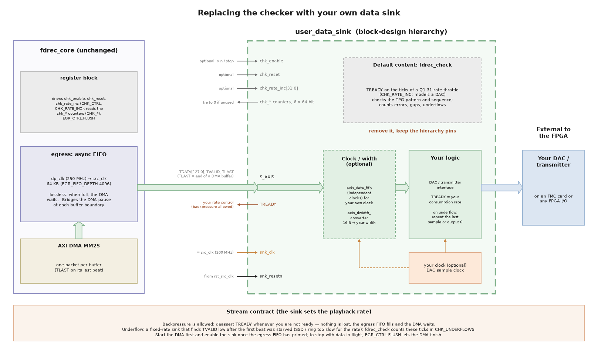

# Replacing the checker with your own data sink

Playback sends a recording back into the fabric: the AXI DMA MM2S channel reads the DDR
buffers and `fdrec_core` streams them out to the `user_data_sink` hierarchy. On the reference
design that hierarchy holds `fdrec_check`, which verifies the test pattern. For a real
application (a DAC, a transmitter, a stimulus generator) you replace it with your own logic.
`fdrec_core`, the AXI DMA and the driver stay the same.

## Hierarchy pins

| Pin | Direction | Width | Description |
|---|---|---|---|
| `snk_clk` | in | 1 | Sink clock. This is the same clock as `src_clk` (PS `pl_clk2`, 200 MHz, on the Zynq UltraScale+ designs). |
| `snk_resetn` | in | 1 | Active-low reset, synchronous to `snk_clk` (from `rst_src_clk`). |
| `S_AXIS` | in | AXI4-Stream | `TDATA[127:0]`, `TVALID`, `TREADY`, `TLAST`. No `TKEEP` or `TUSER`. |
| `chk_enable` | in | 1 | `CHK_CTRL.ENABLE`, synchronised to `snk_clk` (forced low during a soft reset). Optional. |
| `chk_reset` | in | 1 | `CHK_CTRL.RESET` pulse (also held high during a soft reset), synchronous to `snk_clk`. Optional. |
| `chk_rate_inc` | in | 32 | `CHK_RATE_INC`, synchronous to `snk_clk`. Optional. |
| `chk_beats`, `chk_errors`, `chk_gaps`, `chk_gap_beats`, `chk_underflows`, `chk_last_seq` | out | 64 each | Read back as the `CHK_*` registers (one coherent snapshot). Tie to 0 if unused, or reuse them for your own status counters. |

## The stream contract

* **Data**: each beat is 16 bytes of the file, little-endian — `TDATA[7:0]` is the first byte
  of each 16-byte block, exactly as `fdrec` recorded it.
* **`TLAST`** marks the last beat of each DMA buffer (the playback app's `--buf-size`). It is
  not a frame marker of your data; ignore it unless you want buffer boundaries.
* **Backpressure is allowed.** Deassert `TREADY` whenever you are not ready. Nothing is lost:
  the egress FIFO (4096 beats = 64 KB) fills and then the DMA waits. Data only arrives as fast as
  the DMA and the SSDs can deliver it, so the playback rate is set by the sink.
* **Underflow.** A sink that must consume at a fixed rate (a DAC) sees `TVALID` low when the
  SSD, the DMA or the driver cannot keep up. Your logic decides what to output then (repeat
  the last sample, output zero, ...). `fdrec_check` counts these events in `CHK_UNDERFLOWS`:
  ticks of its rate throttle on which `TVALID` was low, after the first beat, and only when
  more data followed — the idle time after the end of a playback is not an underflow. A
  playback of a TPG recording is clean when `CHK_ERRORS` = 0, `CHK_UNDERFLOWS` = 0 and
  `CHK_GAP_BEATS` equals the drop count in the file header.
* **Priming.** At the start of a playback the egress FIFO is empty. A fixed-rate sink should
  start consuming only once data is buffered: start the DMA first, wait for the egress FIFO
  to fill (`EGR_FIFO_LEVEL`), then set `CHK_CTRL.ENABLE`. If you use `chk_enable` as your
  sink's run control you get the same behaviour.
* **Stopping.** If your sink stops consuming (for example `chk_enable` = 0) while a DMA
  transfer is in progress, the DMA stalls. Set `EGR_CTRL.FLUSH` to let it finish: beats are
  then accepted and discarded (counted in `EGR_DISCARD`).

## Rate throttle (`fdrec_check`)

`CHK_RATE_INC` is a Q1.31 fraction of one beat per `snk_clk` cycle, exactly like
`TPG_RATE_INC`: `0x8000_0000` = ready on every clock (the default, 3.2 GB/s with a 200 MHz clock),
larger values clamp. `rate_bps = CHK_RATE_INC / 2^31 × SRC_CLK_HZ × 16`. A 31-bit fractional
accumulator asserts `TREADY` on every carry, so the long-term rate is exact. While
`CHK_CTRL.ENABLE` is 0, `TREADY` is 0.

## Clocking and width

The read side of the egress FIFO runs on `fdrec_core`'s `src_clk`, so the sink shares the
source's clock. If your sink needs a different clock, put an independent-clock AXI4-Stream
FIFO (`axis_data_fifo` with `IS_ACLK_ASYNC = 1`) inside `user_data_sink` between `S_AXIS` and
your logic. For a narrower sink, use an `axis_dwidth_converter` (16 bytes → your width) in the
hierarchy; with backpressure allowed it works without any special care.

## Step by step

1. In the block-design script of your target's device family
   (`Vivado/src/bd/bd_zynqmp.tcl` for Zynq UltraScale+), find the `user_data_sink` hierarchy. Replace
   `create_bd_cell -type module -reference fdrec_check user_data_sink/fdrec_check_0` and its
   connections with your own IP or module reference. Keep the hierarchy pins; tie the
   `chk_*` counter outputs to 0 (an `xlconstant` of width 64) if you have nothing to report.
   Using `chk_enable` as your sink's run control is a good idea: it lets software start
   your sink after the egress FIFO has primed, and stop it.
2. Put your RTL in `Vivado/src/hdl/` (top module in a `.v` file, as for the source).
3. Rebuild with `./build.sh xsa --target <target>` and check timing, then rebuild the
   Linux image (`./build.sh yocto --target <target>`).
4. Play a recording with `fdplay --no-check <file>`. `--no-check` makes `fdplay` leave
   the checker registers alone: it does not reset or enable them and it does not compare
   the checker counters. If your sink uses `chk_enable`, set it by hand first
   (`echo 1 | sudo tee /sys/class/misc/fdrec0/chk_enable`), otherwise the stream stalls
   and `fdplay` gives up after `--timeout` seconds with exit code 1. Without the checker
   the exit code only tells you whether the playback was complete; underflow detection is
   up to your sink.
