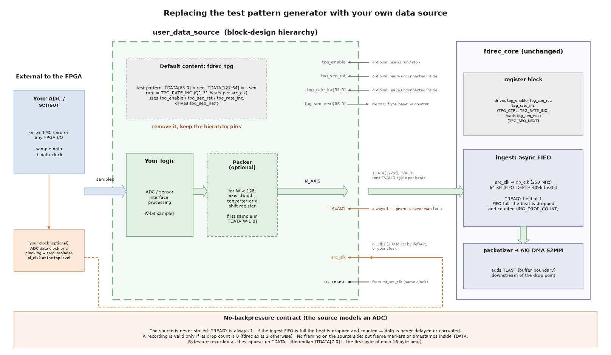

# Replacing the test pattern generator with your own data source

The reference design records data from a test pattern generator (`fdrec_tpg`). For a real
application you replace it with your own ADC, sensor or processing logic. Everything you
need to change is inside one block design hierarchy, `user_data_source`. The rest of the
design (`fdrec_core`, the AXI DMA, the driver and the apps) stays the same. For the playback
direction, see [Replacing the checker with your own data sink](custom_sink).



## The insertion point

The `user_data_source` hierarchy has these pins:

| Pin | Direction | Width | Description |
|---|---|---|---|
| `src_clk` | in | 1 | Source clock. On the Zynq UltraScale+ designs this is PS `pl_clk2` (200 MHz). |
| `src_resetn` | in | 1 | Active-low reset, synchronous to `src_clk` (from `rst_src_clk`). |
| `M_AXIS` | out | AXI4-Stream | `TDATA[127:0]`, `TVALID`, `TREADY` (see below). No `TLAST`, `TKEEP` or `TUSER`. |
| `tpg_enable` | in | 1 | `TPG_CTRL.ENABLE`, already synchronised to `src_clk`. Optional. |
| `tpg_seq_rst` | in | 1 | `TPG_CTRL.SEQ_RST` pulse (also held high during a soft reset), synchronous to `src_clk`. Optional. |
| `tpg_rate_inc` | in | 32 | `TPG_RATE_INC`, synchronous to `src_clk`. Optional. |
| `tpg_seq_next` | out | 64 | Read back as `TPG_SEQ_NEXT`, sampled in the `src_clk` domain. Tie to 0 if unused. |

`M_AXIS` and all the `tpg_*` signals are in the `src_clk` domain. `fdrec_core` does every
clock-domain crossing, so your logic only has to deal with `src_clk`.

### The no-backpressure contract

The recorder assumes your source **cannot be stalled**, like an ADC:

* Drive `TVALID` high for one `src_clk` cycle for every 128-bit beat you produce.
* `TREADY` is always 1. You can leave it unconnected. Do not wait for it.
* If the ingest FIFO is full, `fdrec_core` drops the beat and counts it in `ING_DROP_COUNT`.
  The data is never delayed and never corrupted. A beat is either recorded or counted as
  dropped. A recording is only valid if the drop count is 0, and `fdrec` exits with code 2
  if it is not.
* Data is recorded byte-for-byte as it appears on `TDATA`, little-endian: `TDATA[7:0]` is the
  first byte of each 16-byte beat in the file.
* There is no framing on the source side. `fdrec_core` adds `TLAST` itself, downstream of the
  drop point. If you need markers in the data (frame starts, timestamps, channel numbers),
  put them in `TDATA`.

## Clocking

You can use any clock for `src_clk`. At the top level of the block design, remove the
`src_clk` net's connection to the PS clock (`pl_clk2` on Zynq UltraScale+) and connect your
own clock (for example an ADC data clock, or the output of a clocking wizard).
Connect `rst_src_clk/slowest_sync_clk` to the same clock, so that `src_resetn` stays
synchronous to it. The same net also clocks `fdrec_core`'s source side and the
`user_data_sink` hierarchy (`snk_clk`): the playback sink always runs on `src_clk`. Then set the
`SRC_CLK_HZ` parameter of `fdrec_core/fdrec_core_0` to the real frequency, so that software
can compute rates from it. The block design script sets it from the PS clock with:

```tcl
set_property CONFIG.SRC_CLK_HZ $src_clk_hz [get_bd_cells fdrec_core/fdrec_core_0]
```

The clock is asynchronous to `dp_clk`, and needs no extra constraints for the recorder (the
crossings use XPM macros). Your own clock still needs its usual `create_clock` constraint if
it comes from a pin.

**Rate limits.** The average input rate must stay below what the rest of the chain can
sustain, otherwise beats are dropped:

* The fabric datapath: `dp_clk` × 16 B = 4 GB/s (250 MHz `dp_clk`).
* The SSD (or the RAID0 array) sustained write rate, which is usually much lower. Use
  `fdbench.sh` to measure it for your board and SSD.

The ingest FIFO (64 KB) only absorbs short bursts, for example a 4 GB/s source can run for
about 16 µs into an empty FIFO with nothing draining it. If your source is bursty, its
average over a few milliseconds is what matters. You can make the FIFO deeper with the
`FIFO_DEPTH` parameter of `fdrec_core_0` (a power of 2, in 128-bit beats).

## Data width

The stream is 128 bits wide. If your source produces 128-bit words, connect it directly.

If your source is narrower, pack its samples into 128-bit beats before `M_AXIS`. There are
two common ways:

* **AXI4-Stream Data Width Converter** (`axis_dwidth_converter`). Put it in
  `user_data_source` between your source and `M_AXIS`, with the slave side at your width
  (for example 4 bytes) and the master side at 16 bytes. It collects 4 × 32-bit words into
  one 128-bit beat. The converter has a `TREADY` input, but `fdrec_core` always drives it
  high, so the converter never stalls your source.
* **Your own packing logic.** A shift register that collects N samples and pulses `TVALID`
  every Nth sample. This is a few lines of RTL and costs almost nothing.

In both cases the first sample ends up in the lowest bits (`TDATA[W-1:0]`), so it is the first
in the file. If you stop with a partly filled beat, those samples are not recorded.

If your source is wider than 128 bits, or faster than one beat per `src_clk` cycle, use a
faster `src_clk` and a width converter, or split the data into 128-bit beats yourself.

## What about the TPG controls?

The `tpg_*` pins exist so that the built-in test pattern generator can be controlled from
software. Your source can use them however you like, or not at all:

* Use `tpg_enable` as a run/stop control, so that `fdrec` can start and stop your source
  through the driver's `tpg_enable` sysfs attribute. Otherwise run `fdrec --no-tpg`, so that
  it leaves the TPG registers alone.
* Leave `tpg_seq_rst` and `tpg_rate_inc` unconnected if they mean nothing to your source.
* Tie `tpg_seq_next` to 0 if you do not have a sample counter. Software only uses it to fill
  in `first_seq` in the file header for TPG recordings.

Note that `fdverify` checks the TPG pattern (a sequence number in the low half and its
complement in the high half). It cannot verify recordings from your own source. Use
your own tools to check them, and use `ING_DROP_COUNT` / the file header's `drop_count` to
know that no data was lost.

## Step by step

1. In the block-design script of your target's device family
   (`Vivado/src/bd/bd_zynqmp.tcl` for Zynq UltraScale+), find the `user_data_source` hierarchy. Replace
   `create_bd_cell -type module -reference fdrec_tpg user_data_source/fdrec_tpg_0` and
   its connections with your own IP or module reference. Keep the hierarchy pins as they are.
2. Put your RTL in `Vivado/src/hdl/`. `build.tcl` adds every `.v` / `.sv` file there to the
   project. The top module of a module reference must be in a Verilog (`.v`) or VHDL file.
   Vivado 2025.2 does not accept a SystemVerilog file as a module-reference top
   (`[filemgmt 56-195]`), but SystemVerilog submodules are fine.
3. If you change `src_clk`, update its source and `SRC_CLK_HZ` as described above.
   Leave the `tpg_*` pins that your logic does not use unconnected inside the hierarchy,
   and tie `tpg_seq_next` to 0 (an `xlconstant` of width 64) if you have no counter.
4. Rebuild with `./build.sh xsa --target <target>` and check timing, then rebuild the
   Linux image with `./build.sh yocto --target <target>` (the bitstream is in `BOOT.BIN`).
   The driver and the apps need no change.
5. Record with `fdrec --no-tpg <file>` and check that the exit code is 0 (drop count 0).
   If your source is not producing data, `fdrec` stops after `--timeout` seconds (default
   10) with exit code 1 instead of waiting forever.

You can also make the change interactively: build the project with
`./build.sh project --target <target>`, open it from `Vivado/<target>/` in the Vivado GUI,
edit the `user_data_source` hierarchy, then copy the change back into the Tcl script so
that it survives a rebuild.
