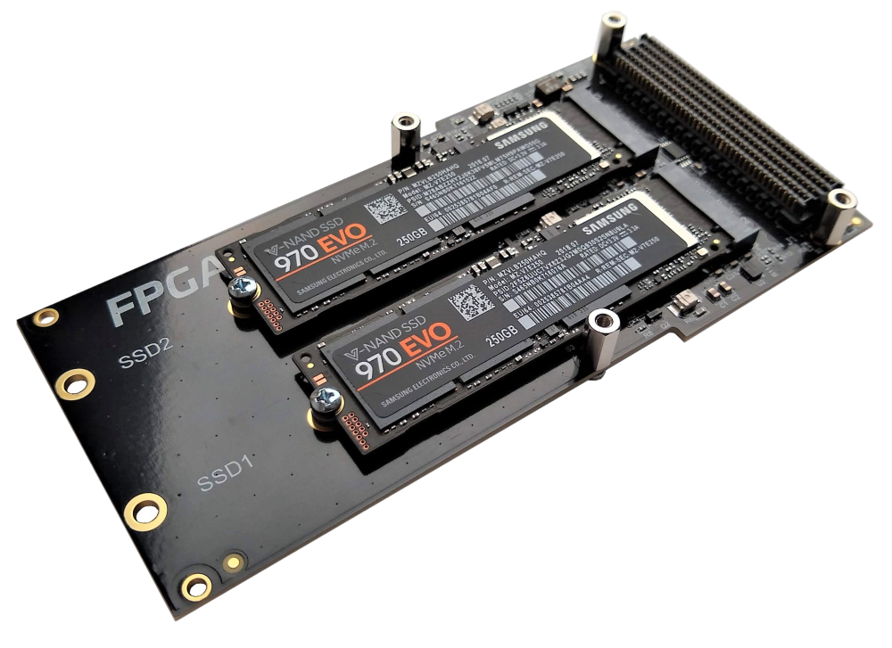
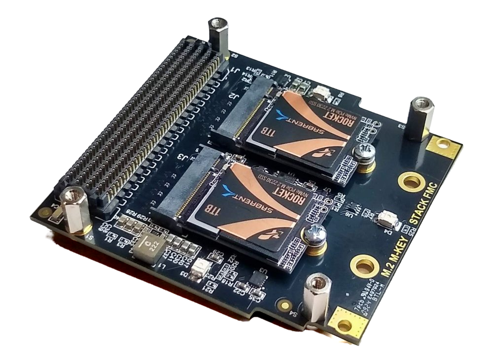
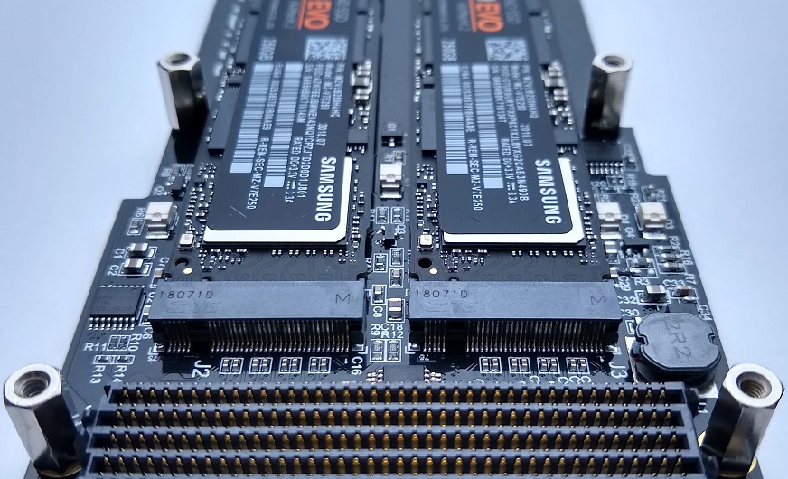

# Description

The FPGA Drive Recorder is a reference design that records data generated in the FPGA
fabric to a file on one or two NVMe SSDs, and plays recordings back into the fabric. The
SSDs connect to the FPGA through the FMC connector with Opsero's [FPGA Drive FMC Gen4]
(OP063) or [M.2 M-key Stack FMC] (OP073).

| FPGA Drive FMC Gen4 | M.2 M-key Stack FMC |
|---|---|
|  |  |

## What the design does

Linux runs on the processor of the target board and owns the SSDs and the filesystem.
The recording is **zero-copy**:

* A fabric DMA (the AMD AXI DMA) writes the data stream into a ring of buffers in the
  processor's DDR memory. The buffers are 2 MB hugepages that the recorder app allocates
  and the `fdrec` kernel driver pins for the DMA.
* When a buffer is full, the app writes it to a file with an `O_DIRECT` write. The NVMe
  controller of the SSD reads the data straight out of that same buffer.
* The CPU never reads, writes or copies the data. It only does the bookkeeping: DMA
  descriptors, cache maintenance and the I/O requests.

The data source is a block-design hierarchy (`user_data_source`) with a 128-bit
AXI4-Stream output. In the reference design it holds a test pattern generator, which
models an ADC: it produces data at a programmable rate and cannot be stalled. You replace
it with your own ADC, sensor or processing logic (see [custom data source](custom_source)).
If the SSDs cannot keep up, the data that does not fit is dropped and counted in the
fabric, never silently lost: every recording reports its drop count, and a valid
recording has a drop count of zero. The `fdverify` tool checks a test-pattern recording
beat by beat.

Playback runs the same path in reverse: the app reads a recording into the hugepage
buffers with `O_DIRECT` reads, and the DMA streams the buffers into a second hierarchy,
`user_data_sink`. In the reference design that hierarchy holds a hardware checker that
consumes the stream at a programmable rate, like a DAC, and verifies every beat. You can
replace it with your own logic (see [custom data sink](custom_sink)).

The diagram shows the Zynq UltraScale+ version of the design. The PCIe part, one PCIe Root
Port per M.2 slot, is the design of
[fpga-drive-aximm-pcie](https://github.com/fpgadeveloper/fpga-drive-aximm-pcie); the
recorder adds the data source and sink, the `fdrec_core` FIFOs and registers, and the AXI
DMA. See [Architecture](architecture) for the details.

## Positioning

The FPGA Drive Recorder sits halfway between a plain PCIe Root Port design and a fabric
NVMe host:

* If you only need the SSDs as Linux block devices, or a standalone PCIe test, use
  [fpga-drive-aximm-pcie](https://github.com/fpgadeveloper/fpga-drive-aximm-pcie).
* This design adds a zero-copy data path from the fabric to a file (and back). Linux, its
  NVMe driver and its filesystem stay in charge of the SSD, so recordings are ordinary
  files and the SSDs are ordinary block devices. The sustainable rate is set by the SSDs
  and by the Linux I/O path (see [Benchmarks](benchmarks)).
* It is not a fabric NVMe host engine.

For CPU-less operation or rates beyond what Linux can sustain, hardware NVMe host IP is
available from Missing Link Electronics: see their
[NVMe Streamer](https://www.missinglinkelectronics.com/ip-cores/nvme-streamer/).

## Performance

What the recorder sustains depends on the SSDs far more than on the FPGA: consumer SSDs write
fast only until their SLC cache is full, and the recorder's rate is the drive's worst moment
over the whole recording. Measured rates per target and SSD are on the
[Benchmarks](benchmarks) page, and
[Where the bottlenecks are](benchmarks.md#where-the-bottlenecks-are) explains why you do not
get an SSD's rated speed and what to do about it.

## Hardware platforms

The design supports the target boards listed below. More Linux-capable targets of
fpga-drive-aximm-pcie (Zynq UltraScale+ and Versal) are being added; see
[Architecture](architecture.md#versal-designs) for the Versal version of the design.


    
    
        
            
        
    
    
### {{ group.name }} platforms

| Target board        | Target design | FMC Slot  Used | Active M.2 Slots | PCIe IP | Data DMA | Yocto |
|---------------------|---------------|-------------------|---------------------|---------|----------|-------|
| [{{ design.board }}]({{ design.link }}) | `{{ design.label }}` | {{ design.connector }} | {{ design.lanes | length }}x | [{{ design.ip }}]({{ data.ips[design.ip].link }}) | [axi_dma]({{ data.ips["axi_dma"].link }}) |  ✅  ❌  |




## IP cores

The PCIe Root Ports use the integrated PCIe blocks of the device, and the data DMA is the
AMD AXI DMA. None of them needs a license. The custom logic (`fdrec_*`) is open source,
part of this repository (`Vivado/src/hdl/`).

| IP Label       | IP Name     |
|----------------|-------------|
| {{ label }} | [{{ ip.name }}]({{ ip.link }}) |


## M.2 slots

On targets with two active M.2 slots you can record to one SSD or to both SSDs at once,
striped as a RAID0 array (`fdsetup-raid0.sh`), which roughly doubles the rate that the
SSDs can sustain. A single SSD can be in either slot.

## Software

The design runs embedded Linux built with the AMD Yocto / Embedded Development Framework
(EDF) flow. There is no PetaLinux flow and no standalone (baremetal) application. The
Linux image contains:

| Component | What it does |
|-----------|--------------|
| `fdrec.ko` | Kernel driver: pins the app's hugepage buffers, drives the AXI DMA through the kernel's `xilinx_dma` driver, does the cache maintenance, exposes `/dev/fdrec0` and sysfs counters ([Kernel driver](driver)) |
| `fdrec` | Record the fabric stream to a file ([Applications](apps)) |
| `fdplay` | Play a recording back into the fabric |
| `fdverify` | Verify a test-pattern recording beat by beat |
| `fdbench.sh` | Find the sustained recording rate of a board + SSD combination |
| `fdsetup-raid0.sh` | Prepare the recording filesystem: one SSD or a RAID0 array of two |
| `single_*_test.sh`, `dual_*_test.sh` | The `dd` speed-test scripts of fpga-drive-aximm-pcie, for comparison ([Test the design in Linux](linux_test)) |
| Tools | `nvme-cli`, `mdadm`, `fio`, `xfsprogs`, `pciutils`, `devmem2` and others |

[FPGA Drive FMC Gen4]: https://docs.opsero.com/op063/datasheet/overview/
[M.2 M-key Stack FMC]: https://docs.opsero.com/op073/datasheet/overview/
